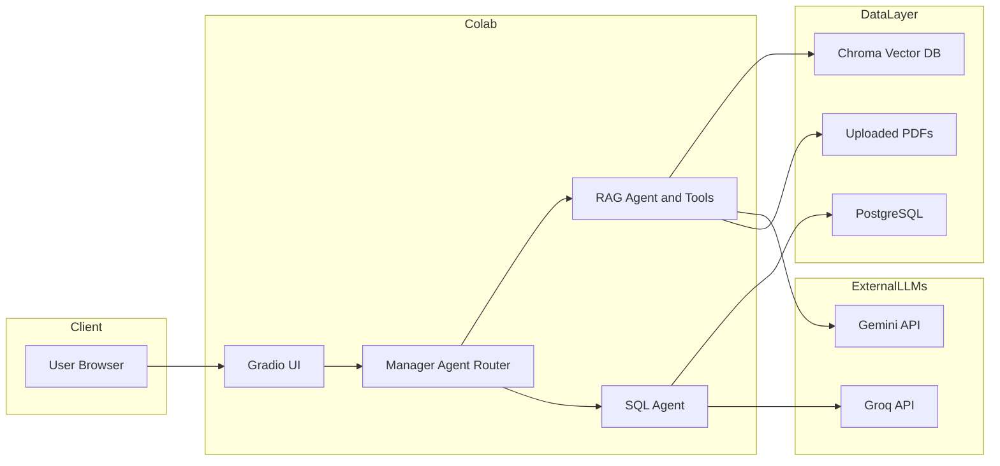
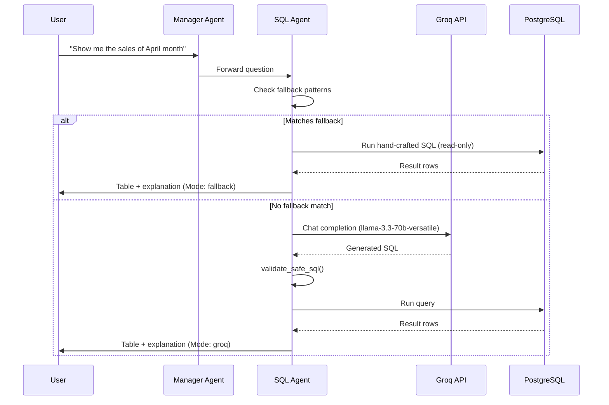
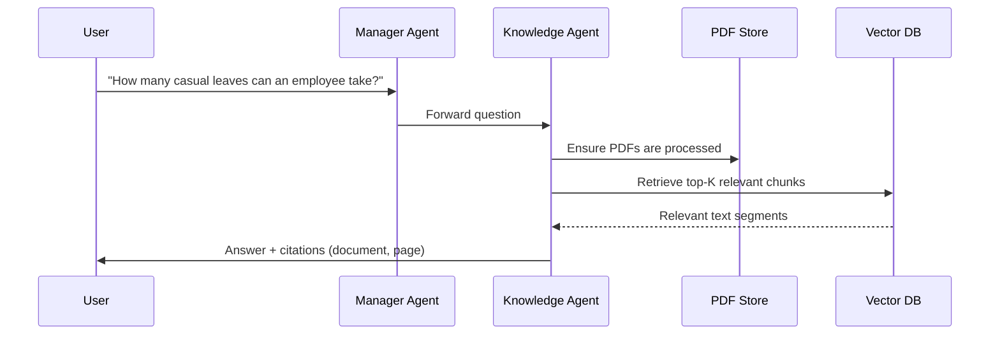

# Enterprise AI Assistant

An end‑to‑end AI assistant for enterprise use cases combining:

- A **SQL Agent** that converts natural language questions into safe PostgreSQL queries.
- A **Knowledge (RAG) Agent** that answers policy and document questions using uploaded PDFs.
- A **Gradio UI** that provides a simple chat interface for business users. [file:1][web:82]

Repo: https://github.com/vijayalakshmi7879/Enterprise_AI_Assistant

This project is designed with security, safety, and development best practices in mind, suitable for code review and extension.

---

## Features

- **Text‑to‑SQL over PostgreSQL**

  - Natural language queries like “Show me the sales of April month” or “Show total revenue by customer”.
  - Read‑only queries only (`SELECT` / `WITH`), with strict validation and safety filters.
  - Hybrid mode:
    - Hand‑crafted SQL templates (fallback) for key metrics (April sales, highest revenue product, sales by month, total revenue).
    - Groq LLM (`llama-3.3-70b-versatile`) for ad‑hoc, exploratory SQL questions (`Mode: groq`). [file:1][web:68][web:29]

- **RAG / Knowledge Agent**

  - Upload internal PDF documents (e.g., HR policies).
  - Chunk, embed, and store in a Chroma vector database.
  - Answer questions like “How many casual leaves can an employee take?” with citations back to specific pages. [file:1][web:23]

- **Gradio UI**

  - Single chat interface where the Manager Agent routes questions either to the SQL Agent or the Knowledge Agent. [file:1][web:82]

---

### High‑level System Diagram



## SQL Agent Flow



- **Security:** `validate_safe_sql` rejects non‑read‑only queries, multiple statements, and dangerous keywords before anything hits the database. [file:1][web:75]

---

## Knowledge (RAG) Agent Flow



- Uploaded PDFs are stored on disk and indexed in `vectordb/` with sentence‑transformer embeddings. [file:1][web:23]

---

## Screenshots

Create a `docs/images/` folder and add UI screenshots, then reference them like:

```markdown
### Gradio Chat UI


### SQL Agent April Sales


### Knowledge Agent HR Policy


```

These will help reviewers quickly understand how the app looks and behaves. [web:79][web:83]

---

## Security, Safety, and Development Practices

### Secrets and Configuration

- All secrets (Groq API key, DB credentials) are loaded from environment variables via `Config`, not hard‑coded. [file:1]
- `.env` is **ignored** via `.gitignore`, and not committed to the public repo.
- Provide `.env.example` with placeholders:

  ```env
  GROQ_API_KEY=your_groq_key_here
  DB_HOST=localhost
  DB_PORT=5432
  DB_NAME=enterprisesales
  DB_USER=enterprisesales_user
  DB_PASSWORD=your_db_password_here
  ```

  so reviewers know how to configure it without seeing real secrets. [web:30]

### Database Safety

- SQL Agent only runs **read‑only** queries:

  - `validate_safe_sql` enforces:
    - Query must start with `SELECT` or `WITH`.
    - No `INSERT`, `UPDATE`, `DELETE`, `DROP`, `ALTER`, `CREATE`, `TRUNCATE`, `ATTACH`, `DETACH`, `PRAGMA`, `REPLACE`.
    - No multiple statements separated by `;`. [file:1]

- PostgreSQL schema:

  - `products(id, name, category, price)`
  - `customers(id, name, city)`
  - `sales(id, sale_date, product_id, customer_id, quantity, total_amount)` [file:1]

- `run_sql_query`:

  - Uses `conn.cursor()`, `fetchall()`, and builds a pandas `DataFrame` from `rows` and `columns`, avoiding unsupported DBAPI behaviours. [file:1][web:26]

For a more production‑grade setup, reviewers could:

- Use a **read‑only DB user** just for this app.
- Restrict that user to the required schema/tables. [web:39][web:40]

### LLM and RAG Safety

- SQL generation prompt includes:

  - Exact schema.
  - Rules to generate a **single read‑only query** only.
  - Guidance to stick to PostgreSQL syntax. [file:1][web:29]

- RAG answers:

  - Always include citations (document + page).
  - Are based on retrieved text from the PDFs, not arbitrary hallucinations. [file:1]

### Error Handling and Logging

- Agents catch internal errors, log them via `log_event`, and return safe messages like:

  > `SQL Agent could not process your question right now.`

- Runtime data (`logs/`, `uploaded_pdfs/`, `vectordb/`, `database/`, `__pycache__/`) is ignored via `.gitignore` and no longer tracked in Git, to prevent accidental leakage of user data or internal artefacts. [file:1][web:30]

### Project Structure

From `tree`:

- Core code:

  - `app/agents/manager.py`, `app/agents/sql_agent.py`
  - `app/db/postgres.py`, `app/db/sqlite_db.py` (legacy)
  - `app/rag/pdf_utils.py`, `rag_agent.py`, `vectordb.py`
  - `app/ui/gradio_app.py`
  - `app/config.py`
  - `main.py`
  - `docker-compose.yml`
  - `requirements.txt`
  - `README.md`, `LICENSE` [file:1]

This makes it clear where to look for:

- Manager agent routing.
- SQL Agent logic.
- RAG logic.
- UI.

---

## Setup and Running Locally

1. **Clone the repo**

   ```bash
   git clone https://github.com/vijayalakshmi7879/Enterprise_AI_Assistant.git
   cd Enterprise_AI_Assistant
   ```

2. **Create and fill `.env`**

   ```bash
   cp .env.example .env
   ```

   Fill in:

   - `GROQ_API_KEY` (from Groq console). [web:73]
   - `DB_HOST`, `DB_PORT`, `DB_NAME`, `DB_USER`, `DB_PASSWORD`.

3. **Start PostgreSQL via Docker**

   ```bash
   docker-compose up -d
   ```

4. **Create virtual environment and install dependencies**

   ```bash
   python -m venv .venv
   source .venv/bin/activate  # or .venv\Scripts\activate on Windows

   pip install -r requirements.txt
   ```

5. **Run the app**

   ```bash
   python main.py
   ```

6. **Open the UI**

   - Visit the URL printed by Gradio (typically `http://127.0.0.1:7860`) to interact with the assistant. [web:82]

---

## Example Queries

- **SQL Agent**

  - `Show me the sales of April month` → Mode: fallback, April summary.
  - `Which product generated highest value?` → Mode: fallback, highest revenue product.
  - `Show me the sales in June month` → Mode: groq, June rows.
  - `Show total revenue by customer` → Mode: groq, per‑customer totals. [file:1][web:23]

- **Knowledge Agent**

  - `How many casual leaves can an employee take?`
  - `What is the remote work policy?`  
    → Answers with citations like `HR_Policy_1_.pdf, page 1/2`. [file:1]

---

## License

This project is licensed under the terms specified in `LICENSE`.
